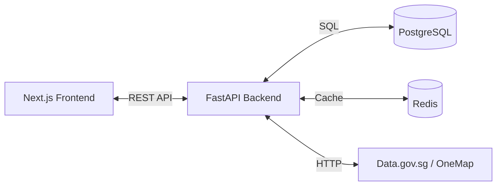

# HDB Buyer Assistant - Development Plan

## Project Overview

The HDB Buyer Assistant is a professional web application designed to democratize access to Singapore's HDB resale market data. It empowers home buyers and investors with a high-performance dashboard featuring real-time transaction data, historical trend analysis, and geographic insights, built on a modern Next.js and FastAPI stack.

## Architecture & Technology Stack

### Recommended Approach
We will use a **Hybrid Architecture** combining a high-performance **FastAPI backend** for data processing and caching with a **Next.js (App Router) frontend** for a responsive, server-rendered UI. This ensures fast initial loads (SSR) and rich interactivity (Client Components) while leveraging Python's data science ecosystem for analytics.

### Key Technologies
- **Next.js 14+**: React framework for SEO-friendly, fast web applications with App Router.
- **FastAPI**: High-performance Python web framework for building APIs with automatic validation.
- **PostgreSQL**: Robust relational database for structured transaction data.
- **Redis**: In-memory data structure store for caching API responses and aggregations.
- **Tailwind CSS & shadcn/ui**: Utility-first CSS and accessible component library for professional UI.
- **Mapbox GL JS**: Interactive vector maps for geographic visualization.

### High-Level Architecture

## Project Phases & PR Breakdown

### Phase 1: Foundation & Data Layer
Establish the project structure, database schema, and robust data ingestion pipeline.

#### PR 1.1: Project Skeleton & Infrastructure
**Branch:** `1.1-project-skeleton`
**Description:** Initialize Next.js and FastAPI projects with Docker configuration.
**Goal:** Running "Hello World" frontend and backend services locally.
**Key Components/Files:**
- `frontend/package.json` (Next.js, Tailwind, shadcn/ui)
- `backend/requirements.txt` (FastAPI, SQLAlchemy, Pydantic)
- `docker-compose.yml` (PostgreSQL, Redis services)
**Dependencies:** None

#### PR 1.2: Database Schema & Models
**Branch:** `1.2-db-schema`
**Description:** Implement SQLAlchemy models and Pydantic schemas for Resale Transactions.
**Goal:** Database tables created and accessible via code.
**Key Components/Files:**
- `backend/app/models.py` (Transaction, Metadata tables)
- `backend/app/schemas.py` (Pydantic models)
- `backend/alembic/` (Migrations)
**Dependencies:** 1.1

#### PR 1.3: Data Ingestion Pipeline
**Branch:** `1.3-data-ingestion`
**Description:** Create service to fetch data from Data.gov.sg and populate PostgreSQL.
**Goal:** Database populated with 212k+ transaction records.
**Key Components/Files:**
- `backend/app/services/data_gov.py` (API Client)
- `backend/app/services/ingestion.py` (ETL Logic)
- `backend/scripts/seed_db.py`
**Dependencies:** 1.2

### Phase 2: Core Dashboard (MVP)
Build the primary dashboard views for market overview and price trends.

#### PR 2.1: Backend API - Summary & Trends
**Branch:** `2.1-api-summary-trends`
**Description:** Implement endpoints for dashboard summary stats and price trend data.
**Goal:** API returns correct aggregated data for frontend consumption.
**Key Components/Files:**
- `backend/app/api/endpoints/dashboard.py`
- `backend/app/services/analytics.py` (Pandas aggregations)
**Dependencies:** 1.3

#### PR 2.2: Frontend - App Layout & Overview
**Branch:** `2.2-fe-layout-overview`
**Description:** Create the main dashboard layout and Overview section with metric cards.
**Goal:** User sees high-level market stats upon loading the app.
**Key Components/Files:**
- `frontend/components/layout/Sidebar.tsx`
- `frontend/app/page.tsx` (Overview Dashboard)
- `frontend/components/dashboard/MetricCard.tsx`
**Dependencies:** 2.1

#### PR 2.3: Frontend - Price Trends Module
**Branch:** `2.3-fe-price-trends`
**Description:** Implement the Price Trends page with interactive Recharts line charts.
**Goal:** User can visualize price movements over time with filters.
**Key Components/Files:**
- `frontend/app/trends/page.tsx`
- `frontend/components/charts/TrendChart.tsx` (Recharts)
- `frontend/components/filters/TrendControls.tsx` (Avg/Median toggle)
**Dependencies:** 2.1

### Phase 3: Advanced Exploration
Enable deep-dive analysis with tabular data, maps, and amenities.

#### PR 3.1: Backend API - Explorer & Geo
**Branch:** `3.1-api-explorer-geo`
**Description:** Endpoints for paginated data explorer, geographic stats, and OneMap amenities.
**Goal:** Support complex filtering and map data retrieval.
**Key Components/Files:**
- `backend/app/api/endpoints/explorer.py`
- `backend/app/services/onemap.py` (Amenities Client)
**Dependencies:** 1.3

#### PR 3.2: Frontend - Data Explorer Table
**Branch:** `3.2-fe-data-explorer`
**Description:** Advanced data table with sorting, pagination, and multi-filters.
**Goal:** User can browse raw transaction data efficiently.
**Key Components/Files:**
- `frontend/app/explorer/page.tsx`
- `frontend/components/ui/data-table.tsx`
- `frontend/components/filters/FilterPanel.tsx`
**Dependencies:** 3.1

#### PR 3.3: Frontend - Mapbox & Amenities
**Branch:** `3.3-fe-mapbox-amenities`
**Description:** Integrate Mapbox GL to show transactions and OneMap amenities on a map.
**Goal:** Visual geographic context for property prices and nearby facilities.
**Key Components/Files:**
- `frontend/components/map/MapComponent.tsx`
- `frontend/components/map/AmenityLayer.tsx`
**Dependencies:** 3.1

### Phase 4: User Features & Polish
Add personalization features and ensure production readiness.

#### PR 4.1: Shortlist Feature (Full Stack)
**Branch:** `4.1-feature-shortlist`
**Description:** Implement "My Shortlist" with manual user inputs (Renovation/Facing).
**Goal:** Users can save and annotate interesting properties.
**Key Components/Files:**
- `backend/app/models.py` (ShortlistItem)
- `backend/app/api/endpoints/shortlist.py`
- `frontend/app/shortlist/page.tsx`
**Dependencies:** 1.2

#### PR 4.2: UI Polish & Optimization
**Branch:** `4.2-ui-polish`
**Description:** Apply final design touches, loading states, and performance optimizations.
**Goal:** Professional, smooth user experience (< 2s load).
**Key Components/Files:**
- `frontend/app/globals.css` (Theme refinements)
- `frontend/components/ui/skeleton.tsx`
- `frontend/lib/utils.ts` (Formatters)
**Dependencies:** All previous

#### PR 4.3: Deployment Configuration
**Branch:** `4.3-deployment`
**Description:** Finalize Dockerfiles and CI/CD configs for Vercel/Railway.
**Goal:** Automated deployment pipeline ready.
**Key Components/Files:**
- `Dockerfile` (Backend)
- `vercel.json`
- `.github/workflows/deploy.yml`
**Dependencies:** All previous

## Implementation Sequence

1. Phase 1 (Foundation) must be completed first to establish the data layer.
2. Phase 2 (Core Dashboard) delivers the MVP value proposition.
3. Phase 3 (Advanced) adds depth and geographic context.
4. Phase 4 (Polish) ensures the product is user-ready.

## Testing Strategy

- **Unit Tests**:
    - Backend: `pytest` for all API endpoints and ETL logic.
    - Frontend: `Vitest` for utility functions and complex components.
- **Integration Tests**:
    - Verify Data.gov.sg ingestion and DB persistence.
    - Test OneMap API integration.
- **E2E Tests**:
    - `Playwright` smoke tests for critical flows (Load Dashboard -> Filter -> View Details).

## Success Criteria

- **Functional**: All 6 dashboard sections operational; Data matches Data.gov.sg.
- **Performance**: Dashboard loads in < 2s; API responds in < 500ms.
- **User Value**: Users can find a flat, check its price trend, view nearby amenities, and shortlist it with notes.

## Known Constraints & Considerations

- **Data.gov.sg Rate Limits**: We must rely heavily on our Redis cache and database, only fetching new data once a month.
- **OneMap Availability**: If OneMap API is down, the map should still function without amenity layers (graceful degradation).
- **Browser Performance**: Rendering thousands of map markers can be heavy; use clustering or server-side aggregation if needed.
